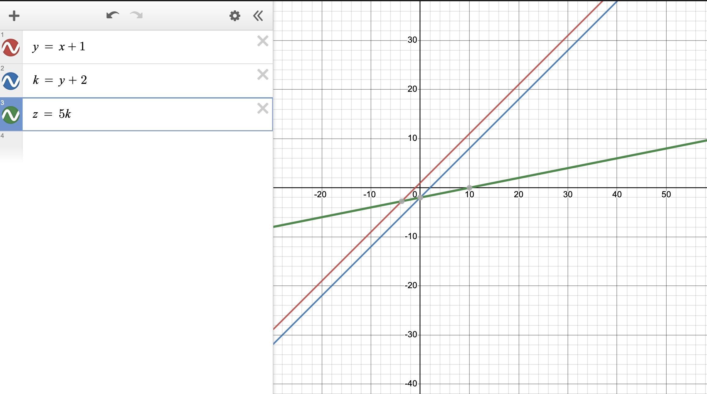

# About neural network 

## basic structure

neural network = input_layer + n*(hidden layer + active function) + output_layer 

The input size is based on yout input data's seize. For example, if you input a $28 \times 28$ pixels' picture with 1 channel, the size of input is 7841 ($28 \times 28 \times 1$) which the input layer has 784 neurals. The number of hidden layer can define by yourself. The number of neural(Nneural) in each hidden layer can also define by yourself. You can try different number of neruals and layers(Nlayer) to optimize your nerwork's performance. Keep in mind that if the Nneural_total is too small means there have less space to help the loss function be decrease which might cause underfitting. higher Nneural will cost higher computer resources. 

If Nneural = 0: the network only can do linearly separable stuff
If Nneural = 1: Can approximate any function that contains a continuous mapping from one finite space to another.

If Nneural = 2:Can represent an arbitrary decision boundary to arbitrary accuracy with rational activation functions and can approximate any smooth mapping to any accuracy.
[From https://medium.com/@gk_/from-introduction-to-neural-networks-for-java-second-edition-eb9a833d568c#:~:text=1%20hidden%20layer%20%2D%20Can%20approximate,smooth%20mapping%20to%20any%20accuracy.]
If Nneural > 2: describe more complex situation

Thinking: higher Nneural and Nlayer means the neural can more fit the train data which cause less loss (with enough epoches). But needs concern the overfit situation. Find a suitable  Nneural and Nlayer takes important place when train own model. 

The output size is depend on what you want to know via this neural network. For example, if you want to know the output data is 'a' or 'b', your output value can be set as a $1 \times 2$ array that [0 1] represent as 'a', [1 0 ] represent as 'b'. Normally, the Noutput_layer = 1

## forward

Forward is calculate by the combination of equations,xt+1 = xt$\times weight$ + $bias$ for all neurals and outputs. Each weights and bias needs be initilise as a random value.

## Loss
Loss = diff between Outputpredict and Outputgt.

## Active funtion 
The output neural is a set of linear equations that cause all the output neurals be liear. The active function can make the each linear equations' output be non-linear which makes the output neural be non-linear.

Below diagram is an example if there do not have active function

## Back propagation
Back propagation takes significant 

## diff between neural network & deep neural network